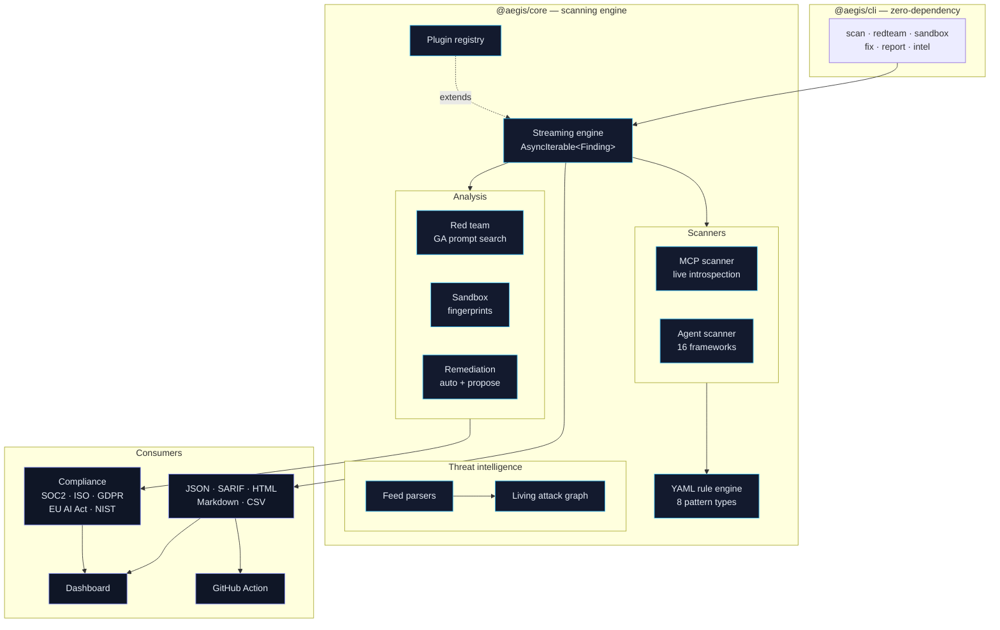

<div align="center">

# 🛡️ Aegis

**The security platform for AI agents.**

Scan MCP servers, agent codebases, and runtime behaviour — with automated
evolutionary red teaming, behavioral fingerprinting, self-healing remediation,
and a living community threat graph.

[](LICENSE)
[](packages/rules/LICENSE)
[](https://nodejs.org)
[](package.json)

</div>

---

## Why Aegis exists

Every tool in application security assumes a human is the one calling functions
with arguments they chose. Agents break that assumption completely: the caller
is a language model, the arguments are generated, and the input often came from
a web page, a document, or another tool's output.

The result is a class of vulnerability that static analysis was never designed
for and that traditional SAST does not detect: **prompt injection in a tool
description**, **an agent reading `.ssh/id_rsa` because something asked it to**,
**two tools that are individually harmless and jointly an exfiltration chain**.

Aegis is built for that class specifically.

## Six things no other tool does together

| | |
|---|---|
| **MCP Supply Chain Graph** | Maps every server, tool, resource, and data flow. Finds the credential→network chains that no single-tool review reveals. |
| **Genetic Algorithm Red Teaming** | Evolves attack prompts by fitness, not list. Finds combinations no one wrote down. |
| **Behavioral Fingerprinting + Shadow Mode** | Fingerprints what an agent *does*. Runs alongside production and predicts what it *would* do, without doing it. |
| **Self-Healing Policies** | Turns a finding into a runtime rule: "if the agent tries to read `/etc/passwd`, block and log." |
| **Living Attack Graph** | Continuously updated from advisories and research, with every node provenance-tracked. |
| **Unified scanning** | MCP + agent code + runtime + red team, in one engine, one finding model, one report. |

---

## Install

Aegis has **zero runtime npm dependencies**. A security tool that pulls thirty
transitive packages to read its own command line has a supply-chain problem,
and if you are deploying this into a customer network you already know it.

```bash
git clone https://github.com/TalhaJadoon123/aegis
cd aegis

# Node 22+ only. Nothing to install.
node packages/cli/src/bin.ts --version
```

Requires Node 22 or later (for native TypeScript execution). For a compiled
build or an npm install:

```bash
pnpm install && pnpm build
aegis --version
```

## Quick start

```bash
# Scan an agent codebase and any MCP configuration it ships with
node packages/cli/src/bin.ts scan ./my-agent

# Machine-readable output for CI
node packages/cli/src/bin.ts scan . --format sarif --output aegis.sarif
node packages/cli/src/bin.ts scan . --format json --quiet

# Evolutionary red team (see --dry-run first)
node packages/cli/src/bin.ts redteam --target http://localhost:8000/agent
node packages/cli/src/bin.ts redteam --dry-run          # no requests sent

# Observe runtime behaviour
node packages/cli/src/bin.ts sandbox --command "python agent.py"

# Fix what is unambiguous, propose the rest
node packages/cli/src/bin.ts fix . --apply

# Compliance attestation for an auditor
node packages/cli/src/bin.ts report . --compliance \
  --organisation "Acme Inc" --system "Support Agent"

# Dashboard
node packages/web/src/bin.mts --data .aegis/dashboard
```

---

## Architecture



### Packages

| Package | License | Description |
|---|---|---|
| [`packages/core`](packages/core) | MIT | Scanning engine, scanners, red team, sandbox, remediation, compliance, threat graph |
| [`packages/cli`](packages/cli) | MIT | The `aegis` command line tool |
| [`packages/rules`](packages/rules) | **CC0** | 76 rules across 6 packs — fork these freely |
| [`packages/web`](packages/web) | Proprietary | Hosted dashboard (also runs fully on-prem) |
| [`packages/action`](packages/action) | MIT | GitHub Action |
| [`packages/intel-feeds`](packages/intel-feeds) | MIT | NVD / GHSA / OSV parsers |

---

## What it finds

Aegis ships 76 rules covering the OWASP Agentic Security Initiative Top 10,
the OWASP Top 10 for LLM Applications, MCP security, prompt injection, supply
chain, and secrets.

```
$ aegis scan ./my-agent

Aegis security scan ./my-agent

  Score 52/100 (F)   3 critical  1 high  1 medium

critical

  CRITICAL openai-api-key hardcoded in source
  src/agent.py:9:19
  CWE-798
    OPENAI_API_KEY = "sk-p************6789"
  → Rotate and remove this openai-api-key
  owasp-agentic/ASI03  soc2/CC6.1  iso27001/A.5.17  gdpr/Art. 32
```

Findings carry a stable content fingerprint, compliance mappings across six
frameworks, and remediation guidance — plus SARIF output with `security-severity`
so they sort correctly in GitHub code scanning.

### Secrets are never echoed

Aegis detects credentials but **never stores the raw value**. Not in the
finding, not in the report, not in the evidence line, not in the JSON export.
A scanner that copies credentials into its own output has widened the exposure
it was built to find.

---

## Evolutionary red teaming

Hand-written jailbreak lists go stale the moment a vendor ships a filter, and
they never explore the space *between* attacks. Aegis treats prompts as a
population under selection pressure.

```
$ aegis redteam --target http://localhost:8000/agent --budget 200

Red team report — localhost:8000

  Attacks run     60
  Successful      15
  Success rate    25.0%
  Risk            CRITICAL

   ! prompt-injection      14/7   61%
   ! data-exfiltration      1/3   33%
     jailbreak              0/5    0%

  *** INCIDENT RESPONSE INDICATED ***
      1 data-exfiltration bypass succeeded. If real user data was reachable
      by this agent, GDPR Art. 34 may require notification within 72 hours.
```

**How it works.** Attacks are *templates* with composable slots, not fixed
strings. A genetic algorithm evolves the slot assignments — crossover at the
slot level rather than the character level, so recombining an authority framing
with an encoding wrapper produces a coherent, novel attack. Fitness is
partially credited, because a GA with a binary success signal on a sparse
outcome is just an expensive random search.

**Deterministic.** Every run is reproducible from its seed. A red team report
that cannot be reproduced is an anecdote, not evidence.

**Safe defaults.** `--dry-run` makes no requests. `--redact-prompts` produces a
shareable report without handing over working exploits — prompts become stable
hashes an auditor can verify but not run.

**False-positive discipline.** A refusal that *mentions* the thing it refuses
("I don't disclose my instructions") is a refusal, not a leak. Aegis
disqualifies indicator matches that fall inside a refusal sentence, and it
guarantees every attack in the catalogue is attempted at least once — so
"0% success rate" never silently means "never tried".

---

## Compliance

Aegis maps findings to 40+ controls across SOC 2, ISO 27001 Annex A, GDPR, the
EU AI Act, NIST AI RMF, and MITRE ATLAS.

It will **not** tell you that you are compliant.

```
> This is an automated assessment of technical control evidence produced by
> Aegis. It is decision support for a qualified assessor. It is not a
> certification, and it does not attest that the organisation complies with
> any framework listed.
```

Three distinctions the report maintains throughout:

- **"No findings" is not "pass."** Aegis did not find anything; only an auditor
  can attest that a control operates effectively.
- **"Not operating effectively"** is asserted only for critical findings with
  concrete evidence.
- **Limitations are listed explicitly**, including that organisational and
  procedural safeguards are out of scope.

A scanner that claims compliance is worse than no scanner, because people act
on the claim.

---

## Remediation that knows when to stop

Aegis draws a hard line between what it will change and what it will only
suggest:

**Auto-applied** (the correct answer is unambiguous):
- Hardcoded secrets → environment variables
- `additionalProperties: true` → `false`
- MCP blanket auto-approval → explicit tool list
- Shell-wrapped MCP launches → direct binary invocation

**Proposed, never applied** (requires judgement):
- Pinning a dependency version
- Replacing `shell=True` with an argument list
- Adding an iteration ceiling to an agent loop

Every remediation — including the automatic ones — carries a **risks** section
and **verification steps**. Application fails closed: if the file changed since
the scan, the fix is refused as stale rather than applied blind.

---

## In CI

```yaml
- uses: TalhaJadoon123/aegis@v1
  with:
    path: .
    format: sarif
    fail-on: high
    comment: true
```

Or generically:

```bash
aegis scan . --format sarif --output aegis.sarif --fail-on high
```

Exit codes: `0` clean, `1` threshold crossed, `2` usage error.

Baseline existing findings so CI only fails on new issues:

```bash
aegis scan . --baseline --baseline-file .aegis/baseline.json
```

---

## Dashboard

```bash
aegis scan . --format json --output .aegis/dashboard/scan.json
node packages/web/src/bin.mts --data .aegis/dashboard
```

Scan history, security score over time, the interactive MCP supply chain graph,
findings with evidence, and the compliance roll-up. Built on `node:http` rather
than a framework — the deployment that matters is on-premise and often
air-gapped, where "npm install and run" beats a build toolchain.

Set `AEGIS_DASHBOARD_TOKEN` to enable API authentication. Without it the server
binds to loopback only, because it renders scan evidence.

---

## Contributing

See [CONTRIBUTING.md](CONTRIBUTING.md), [CODE_OF_CONDUCT.md](CODE_OF_CONDUCT.md),
and [SECURITY.md](SECURITY.md).

Rules are [CC0](packages/rules/LICENSE) — public domain. Fork them freely, or
contribute back. The engine is MIT.

```bash
node --import ./tools/register-ts.mjs --test packages/*/test/*.test.ts
```

---

## Licence

- Engine, CLI, action, feed parsers: **MIT**
- Rule definitions in `packages/rules`: **CC0 1.0** (public domain)
- Hosted dashboard: proprietary

---

<div align="center">
  <sub>Aegis — the security platform for AI agents.</sub>
</div>
